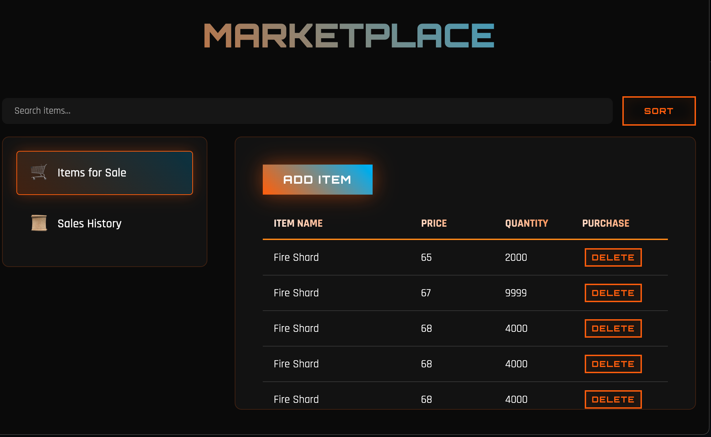
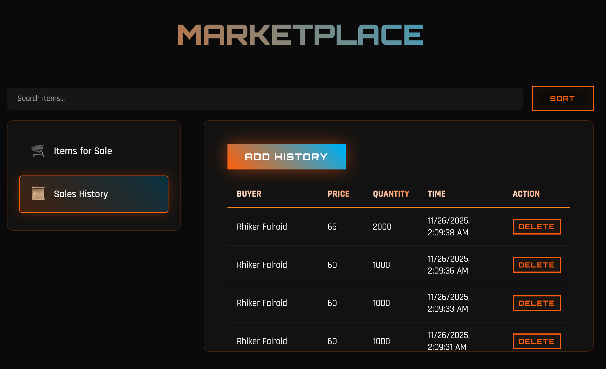
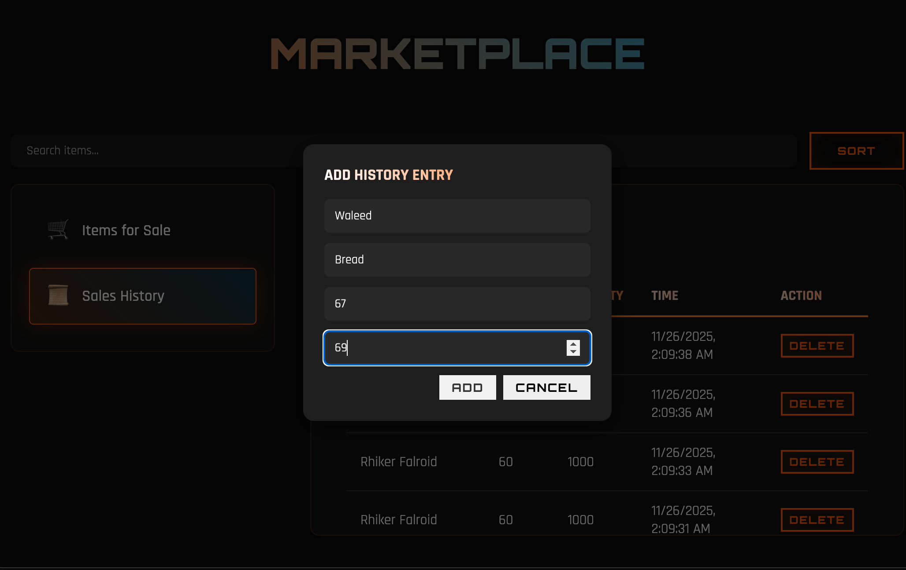
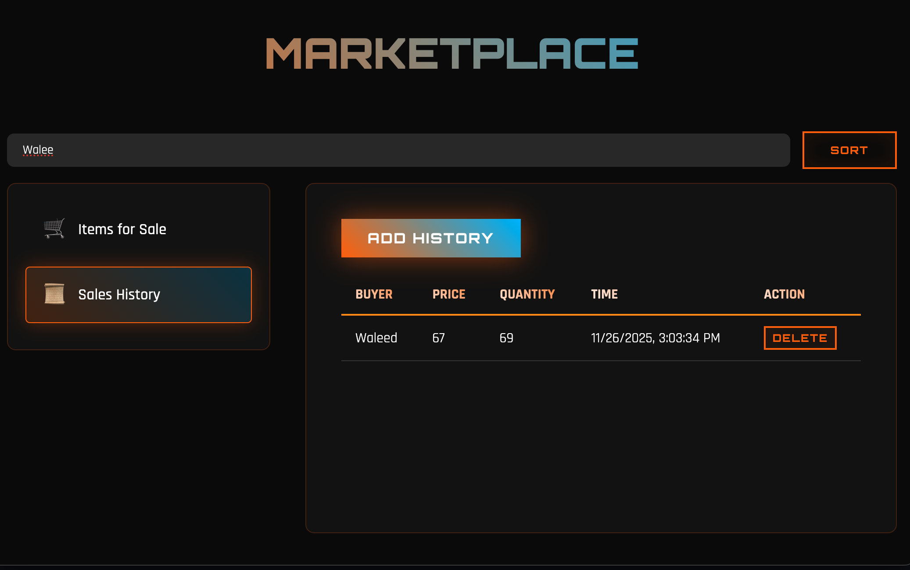

# ff14-market

### Generate Data

Run `generate_data.py` to pull data from the Universalis API

If `history.json` or `postings.json` already has data, you don't need to run the script

### Insert Data

Run `insert.py` to insert the json data into your mongodb database (make sure to change the `HOST` value in the file)


# MarketBoard

MarketBoard interface made using Flask, MongoDB, and JavaScript. 

---

## Features

- Add new items for sale and track details (name, price, quantity, seller).  
- Add sales history entries (buyer, item, price, quantity).  
- Sort sales history by **latest** or **oldest** timestamp.  
- Delete items or sales history entries.  
- Search and filter items or history in real-time.    

---

## Setup

1. **Install Python dependencies**

```
pip install flask flask-cors pymongo
```

2. **Install MongoDB (macOS)**

```
brew tap mongodb/brew
brew install mongodb-community@7.0
```

3. **Start the Flask app**
```
python3 MarketBoard.py
```

4. **Run Aggregations**
```
python3 analyticsAgg.py
```

5.  **Run on Local Server.**
```
 You should get a console report such as * Running on http://127.0.0.1:5000 after starting the Flask app
```
---

## Pictures


- Items for sale.


- Trade history by various users.


- Creating new entries.


- Filter to find items.

